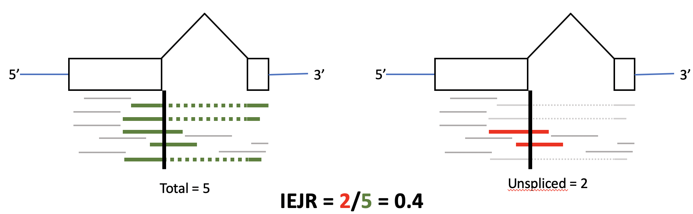

# IntronExon_Junction_Splice_Ratio

## Usage 
The Intron/Exon-Junction Splice Ratio (IEJR) used to calculate the fraction of spliced reads crossing the 5' splice junction of every Saccharomyces cerevisiae intron. 

Input for the analysis is a folder of bam files. 

IEJR Analysis Concept


IEJR Pipeline 


IEJR ≈ 1 indicates nearly all mapped reads are unspliced over a 5' splice junction


IEJR ≈ 0.5 indicates half of mapped reads are unspliced over a 5' splice junction


IEJR ≈ 0 indicates nearly all mapped reads are spliced over a 5' splice junction


## Implementation 
Execute ```make help```  or simply ```make```  to see a list of options. 

1. Place all bam files for analysis in a single folder. The empty bam folder in this repository will work perfectly, however you can specify the target directory in the Makefile with the "bam_folder" variable. Default is  ```bam_folder:=bam``` 

2. Execute ```make count``` from the command line while in the top of the project directory. 

    This will use bedtools coverage to count spliced and unspliced reads found in the bam folder. Output is in the res folder.  Key output files are as follows:
* Individual sample count files
* Combined matrix of total splice junction reads (totalSpliceJunctionCount.tab)
* Combined matrix of unspliced splice junction reads (unsplicedSpliceJunctionCount.tab)
* .txt file of sample file names (sample_names.txt)

3. Execute ```make IEJR``` from the command line while in the top of the project directory. 
    
    This calls the in src/calculateIEJR.R script to load the combined matracies and sample names from the res folder into R and calculate IEJR for each gene.
    Please install necessary dependencies such as tidyverse, dyplr, here, and ggplot2.
    Modify depthCutoff and asociated code to customize depth requirements for loci to be analyzed. The default is to throw out any locus that has a median total junction count of less than 5 between all samples. 
   ```
   depthCutoff <- 5
   message("Depth Cutoff = ", depthCutoff)
   passesCutoff <- (apply(totalCounts[,3:(2+number_of_samples)], 1, FUN=median)) >= depthCutoff

4. Visualize IEJR if you wish. Example ggplot2 commands are provided in src/calculateIEJR.R which analyze data from Barass et al., 2015 (doi: 10.1186/s13059-015-0848-1). IEJR shows how changing 4tU labeling times for nascent RNAs captures more and more unspliced reads. 

    

## Contributing
Pull requests are welcome. For major changes, please open an issue first to discuss what you would like to change.

## Dependencies
Applications required for this analysis include bedtools (v2.28.0). 

R Packages required for this analysis include tidyverse, dyplr, here, and ggplot2.
